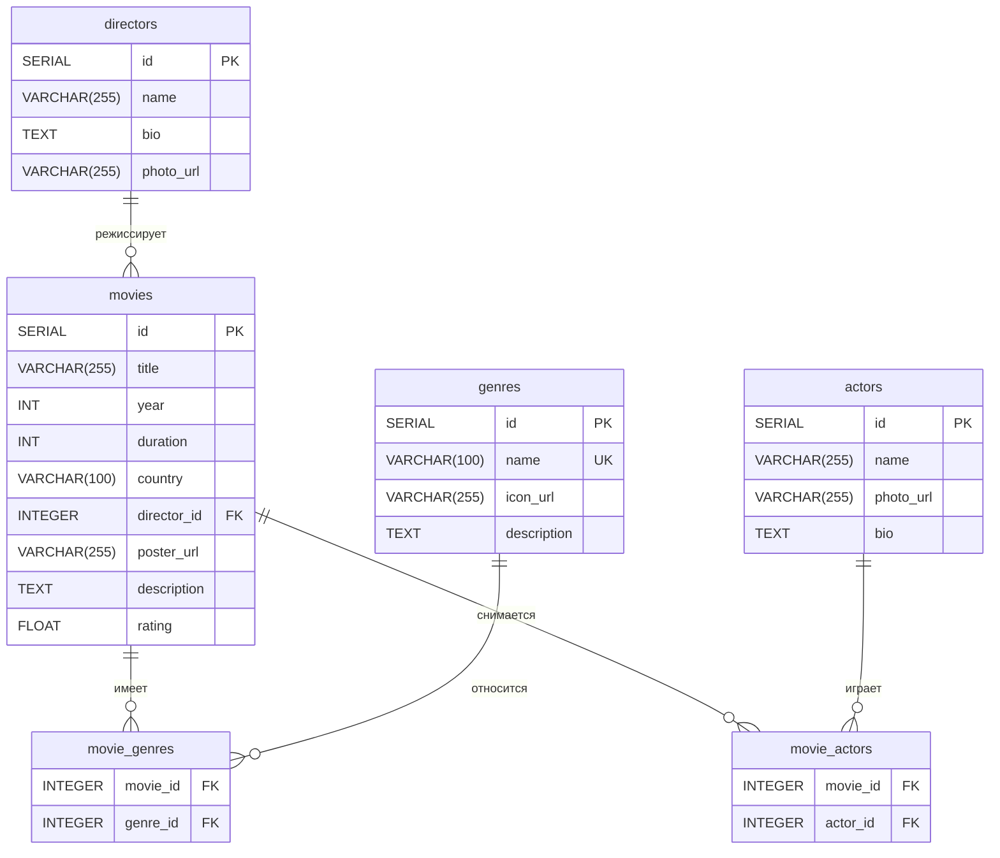

# Схема базы данных

## Визуальная схема архитектуры

```
┌─────────────────────────────┐
│       DIRECTORS             │
│  (Режиссёры)                │
├─────────────────────────────┤
│ 🔑 id (SERIAL)              │
│    name (VARCHAR 255)       │
│    bio (TEXT)               │
│    photo_url (VARCHAR 255)  │
└──────────────┬──────────────┘
               │
               │ 1:N (один режиссёр → много фильмов)
               │
               ▼
┌─────────────────────────────────────────────────────────┐
│                    MOVIES                                │
│                   (Фильмы)                               │
├─────────────────────────────────────────────────────────┤
│ 🔑 id (SERIAL)                                           │
│    title (VARCHAR 255)                                   │
│    year (INT)                                            │
│    duration (INT)                                        │
│    country (VARCHAR 100)                                 │
│ 🔗 director_id (INT) → REFERENCES directors(id)         │
│    poster_url (VARCHAR 255)                              │
│    description (TEXT)                                    │
│    rating (FLOAT)                                        │
└────────────┬───────────────────────────┬─────────────────┘
             │                           │
             │ N:M                       │ N:M
             │                           │
             ▼                           ▼
┌────────────────────────┐    ┌────────────────────────┐
│   MOVIE_GENRES         │    │   MOVIE_ACTORS         │
│  (Связь фильмы-жанры)  │    │  (Связь фильмы-актёры) │
├────────────────────────┤    ├────────────────────────┤
│ 🔗 movie_id (INT) PK   │    │ 🔗 movie_id (INT) PK   │
│ 🔗 genre_id (INT) PK   │    │ 🔗 actor_id (INT) PK   │
└────────┬───────────────┘    └──────────┬─────────────┘
         │                               │
         │ N:M                           │ N:M
         │                               │
         ▼                               ▼
┌─────────────────────────────┐  ┌─────────────────────────────┐
│         GENRES              │  │         ACTORS              │
│        (Жанры)              │  │        (Актёры)             │
├─────────────────────────────┤  ├─────────────────────────────┤
│ 🔑 id (SERIAL)              │  │ 🔑 id (SERIAL)              │
│    name (VARCHAR 100) 🔒    │  │    name (VARCHAR 255)       │
│    icon_url (VARCHAR 255)   │  │    photo_url (VARCHAR 255)  │
│    description (TEXT)       │  │    bio (TEXT)               │
└─────────────────────────────┘  └─────────────────────────────┘
```

**Легенда:**
- 🔑 = Первичный ключ (Primary Key)
- 🔗 = Внешний ключ (Foreign Key)
- 🔒 = Уникальное ограничение (UNIQUE)
- PK = Часть составного первичного ключа
- 1:N = Связь один-ко-многим
- N:M = Связь многие-ко-многим

## Диаграмма Mermaid (для GitHub)



## Описание таблиц

### 1. **directors** - Режиссёры
Хранит информацию о режиссёрах фильмов.
- **id**: Первичный ключ (автоинкремент)
- **name**: Имя режиссёра (обязательное)
- **bio**: Биография
- **photo_url**: URL фотографии

### 2. **genres** - Жанры
Справочник жанров фильмов.
- **id**: Первичный ключ (автоинкремент)
- **name**: Название жанра (уникальное, обязательное)
- **icon_url**: URL иконки жанра
- **description**: Описание жанра

### 3. **movies** - Фильмы
Основная таблица с информацией о фильмах.
- **id**: Первичный ключ (автоинкремент)
- **title**: Название фильма (обязательное)
- **year**: Год выпуска (обязательное)
- **duration**: Длительность в минутах (обязательное)
- **country**: Страна производства
- **director_id**: Внешний ключ на directors
- **poster_url**: URL постера
- **description**: Описание фильма
- **rating**: Рейтинг (дробное число)

### 4. **movie_genres** - Связь фильмов и жанров
Связующая таблица для связи многие-ко-многим между фильмами и жанрами.
- **movie_id**: Внешний ключ на movies (составной первичный ключ)
- **genre_id**: Внешний ключ на genres (составной первичный ключ)

### 5. **actors** - Актёры
Хранит информацию об актёрах.
- **id**: Первичный ключ (автоинкремент)
- **name**: Имя актёра (обязательное)
- **photo_url**: URL фотографии
- **bio**: Биография

### 6. **movie_actors** - Связь фильмов и актёров
Связующая таблица для связи многие-ко-многим между фильмами и актёрами.
- **movie_id**: Внешний ключ на movies (составной первичный ключ)
- **actor_id**: Внешний ключ на actors (составной первичный ключ)

## Типы связей

### Один-ко-многим (1:N)
- **directors → movies**: Один режиссёр может снять много фильмов
  - `movies.director_id REFERENCES directors.id`

### Многие-ко-многим (N:M)
- **movies ↔ genres**: Фильм может иметь несколько жанров, жанр может относиться к нескольким фильмам
  - Через таблицу `movie_genres`
  
- **movies ↔ actors**: Фильм может иметь несколько актёров, актёр может сниматься в нескольких фильмах
  - Через таблицу `movie_actors`

## Индексы и ограничения

### Первичные ключи
- `directors.id`
- `genres.id`
- `movies.id`
- `actors.id`
- `movie_genres (movie_id, genre_id)` - составной
- `movie_actors (movie_id, actor_id)` - составной

### Уникальные ограничения
- `genres.name` - имя жанра должно быть уникальным

### Внешние ключи
- `movies.director_id → directors.id`
- `movie_genres.movie_id → movies.id`
- `movie_genres.genre_id → genres.id`
- `movie_actors.movie_id → movies.id`
- `movie_actors.actor_id → actors.id`

## Нормализация

База данных соответствует **третьей нормальной форме (3NF)**:

1. **1NF**: Все атрибуты атомарны (нет повторяющихся групп)
2. **2NF**: Все неключевые атрибуты полностью зависят от первичного ключа
3. **3NF**: Нет транзитивных зависимостей между неключевыми атрибутами

Связи многие-ко-многим реализованы через отдельные связующие таблицы, что обеспечивает гибкость и целостность данных.
